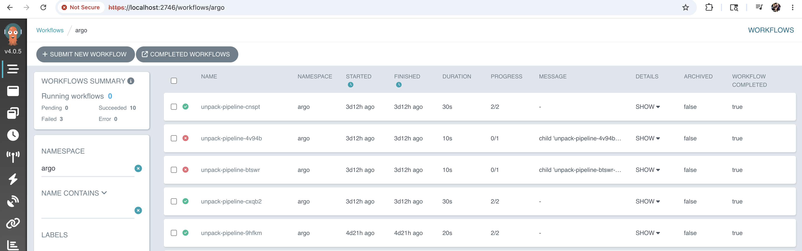
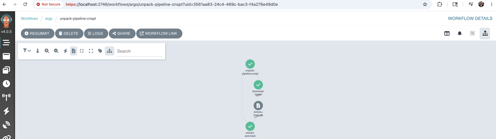

# argo-workflow
learning argo workflow orchestration with different storage options for unpacking and tracking compressed datasets. There are a bunch of open datasets to work on.

The main objectives will eventually achieve are the following:
- Put values into iceberg
- Put values into postgres
- Argo Workflow uncompresses a dataset adds it to both postgres and iceberg

# Getting started

## Run Kubernetes locally

At the moment running a 5 node Kubernetes cluster using Docker Desktop. Using K9s to monitor the cluster

## Argo workflow
For this project, used the argo workflow quick start deployment that comes with minio( opensource variant of S3 object storage )

### Setup

```
kubectl create namespace argo
kubectl apply --server-side -n argo -f "https://github.com/argoproj/argo-workflows/releases/download/v4.0.5/quick-start-minimal.yaml"
```
After running that command you should see the following services for argo spin up.

```
➜  trino-helm git:(main) kubectl get svc -n argo
NAME          TYPE        CLUSTER-IP      EXTERNAL-IP   PORT(S)             AGE
argo-server   ClusterIP   10.96.146.175   <none>        2746/TCP            10d
httpbin       ClusterIP   10.96.216.219   <none>        9100/TCP            10d
minio         ClusterIP   10.96.202.37    <none>        9000/TCP,9001/TCP   10d
➜  trino-helm git:(main) ✗
```

port forward the argo-server and minio. Normally create a background process for this.

```
nohup kubectl --namespace argo port-forward svc/minio 9001:9001 &
nohup kubectl --namespace argo port-forward svc/argo-server 2746:2746 &
```

Should be able to access now argo workflow locally at https://localhost:2746

### Upload the pipeline(WIP)
At the the time of this writing, the unpack-pipeline.yaml is pipeline going to working with. For easy uploading going to be using the [Argo CLI](https://github.com/argoproj/argo-workflows/releases/) to upload the pipeline

```
argo submit -n argo unpack-pipeline.yaml
```



Click on the running the job and should see that it succeeded.



## Datastores(WIP)

For this project, is going to be learning how to store the uncompressed object paths in different data stores to get to know which will be more performant.